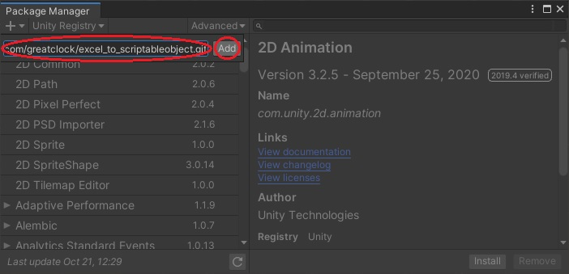
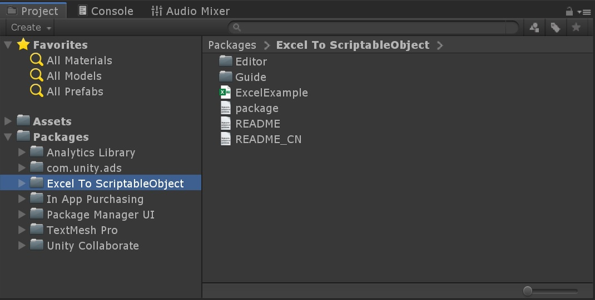

# 使用示例

## 使用git仓库方式导入package到Unity

**注：** 用git仓库方式导入package，并非导入此工具的唯一方式。您亦可将代码及dll文件下载到您的工程中，或者使用npm部署package远程仓库等方式。

**方法1（适用于所有支持package manager版本的Unity）：**

1. 用文本编辑器打开工程目录中Packages/manifest.json

2. 在dependencies中增加一行代码
   
   ```json
   {
     "dependencies": {
       "com.greatclock.exceltoscriptableobject": "git+https://github.com/greatclock/excel_to_scriptableobject.git",
       ...
     }
   }
   ```

3. 保存文件

4. 回到Unity中，此工具将被自动导入

**方法2（仅支持Unity2019或以上版本）：**

1. 打开Package Manager并点击界面左上角的加号，选择“Add package from git URL...”
   
   

2. 输入“https://github.com/greatclock/excel_to_scriptableobject.git”并点击“Add”
   
   

在导入完成后，Project窗口中Packages下会增加“Excel To ScriptableObject”一项。



## 示例内容

### 1. 基础功能

此基础功能示例使用的数据为一组学生数据，其中包含学生姓名性别等基础信息，以及家长及其联系方式等。

此示例同时用于展示数据中基础数据类型、枚举类型、数组类型和数据类型嵌套等的使用。

#### 1.1 从创建新xlsx文件到在运行时读取其定义的数据

[Guide1E1_CN.md](./Guide1E1_CN.md)

- 完整操作流程
- 命名规则
- xlsx文件中使用注释行
- 使用基础数据类型、数组类型
- 读取数据、调试方法

#### 1.2 使用数据类型嵌套

[Guide1E2_CN.md](./Guide1E2_CN.md)

- 在同一个xlsx文件中定义多张表
- 使用自定义的类型并用id或key对数据进行关联
- 隐藏某张表的get方法，使其中数据无法从外部直接读取

#### 1.3 使用枚举类型

[Guide1E3_CN.md](./Guide1E3_CN.md)

- 在表中使用枚举类型
- 在表中预定义枚举类型的枚举值

### 2. 一键对多值

#### 2.1 标识某张表为一键对多值并读取与键对应的全部数据

[Guide2E1_CN.md](./Guide2E1_CN.md)

- 不同表格软件对sheet名称中特殊字符的兼容性
- 避免新建数组或列表对象产生的GC alloc

#### 2.2 在使用数据类型嵌套时，被引用的自定义数据类型为数组的情况

[Guide2E2_CN.md](./Guide2E2_CN.md)

### 3. 字符串类型扩展

#### 3.1 使用多语言特性

[Guide3E1_CN.md](./Guide3E1_CN.md)

- 使用多语言字符串
- 注册多语言键-值转换函数，使读取到的数据直接使用多语言字符串的值

#### 3.2 富文本特性

**注：** 此处富文本是指：文本内容中的某一部分或某几部分，需要根据当前具体逻辑进行填充，如：玩家昵称、当前等级等。并非用于表示文本颜色、尺寸、图文混排等。

[Guide3E2_CN.md](./Guide3E2_CN.md)

- 使用富文本字符串
- 注册富文本转换函数，使读取到的数据直接使用富文本转换过的字符串

### 4. 同一个数据类型的多组.xlsx数据

#### 可能的应用场景

- 用户分组、AB测试：根据用户不同属性加载不同的数据资源，不同组使用的数据资源的类型保持一致。

- 多语言：可根据当前的语言选择对应的语言文本资源文件，避免加载无用的资源，同时也方便切换。

- 离线更新：通过客户端预先加载好更新的数据资源，在某个时间点之后，即使此时玩家离线，也可切换为使用新的数据资源。

#### 操作方法

1. 点击Excel设置中`Slave Excels`列表右下角的加号，增加一个.xlsx文件配置。

2. 选择.xlsx文件并指定其生成的资源存储的目录。

3. 点击`Flush Data`为xlsx文件生成或更新数据文件。

#### 注意事项

- `Slave Excels`中的.xlsx文件将不会有其独立的数据类型文件，生成的数据资源将使用其所在的`Excel Setting`所对应的数据类型。

- `Slave Excels`中的.xlsx文件中所有数据类型的定义应与`Excel Setting`中的.xlsx文件保持一致。

### 5. 对表中的字段进行筛选

某项目中定义规则如下：

- 所有xlsx文件中所有表的前两行分别为字段名称与字段数据类型，第三行用于指定该字段是用于客户端（C）还是用于服务器（S），或二者均有（CS）。

- 若某字段仅用于服务器，则客户端在导入数据时就要忽略这个字段。

实现上述规则的代码如下：

```csharp
// Assets/Editor/ExcelFieldFilterDemo.cs
using GreatClock.Common.ExcelToSO;
public class ExcelFieldFilterDemo {
    // 使用正则表达式进行全部匹配，优先级为0，并读取该列第三行数据（index为2）进行筛选判断。
    [ExcelFieldFilter(eMatchType.Regex, @".+", priority: 0, requireRowIndex: 2)]
    // 筛选函数必须为静态函数。
    // 前两个参数固定为表名和字段名。
    // 其返回值为实际使用的字段名。
    // 若返回值为null或空字符串，则表示此字段不被使用。
    static string DefaultFieldFilter(string tablename, string fieldname, string content) {
        if (!string.IsNullOrEmpty(content) && (content.Contains("c") || content.Contains("C"))) {
            return fieldname;
        }
        return null;
    }
}
```

注：

- 所有表的首列固定为索引，不参与筛选。

- 对于同一个表，可以有多个规则匹配，但只会使用优先级值最大的那一个规则。

- `requireRowIndex`为可选参数，在不使用此参数时，规则函数中的content参数也不应存在。

- 此方法的返回值为代码及资源中实际使用的字段名，可以用此方法对xlsx文件中的字段名进行调整修正。

- 一个筛选函数上可以使用多个`ExcelFieldFilter`。
