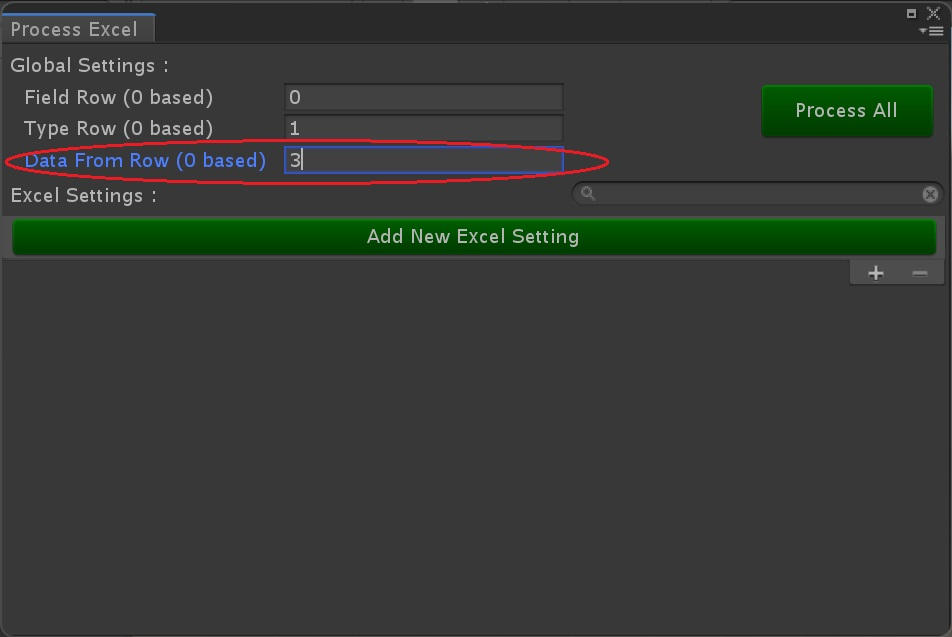
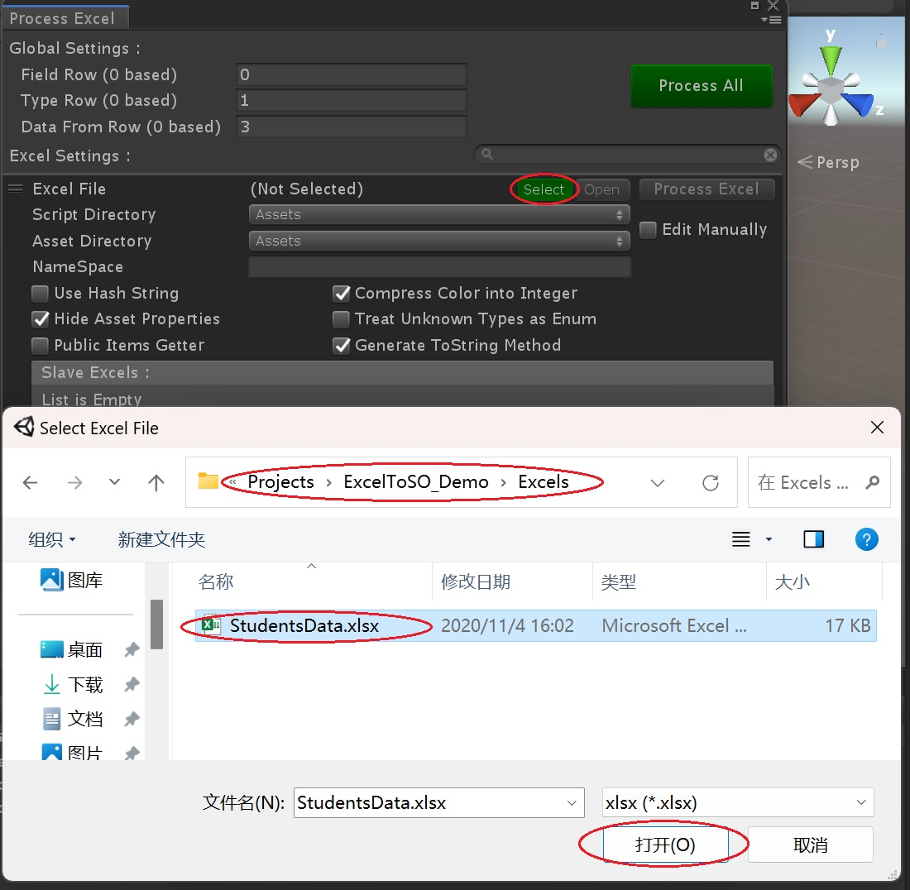
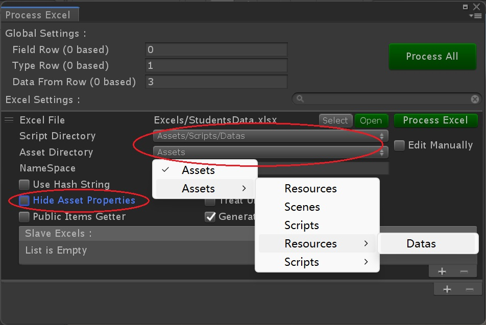
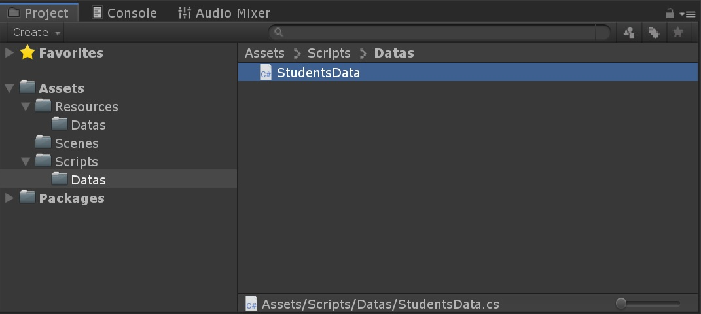
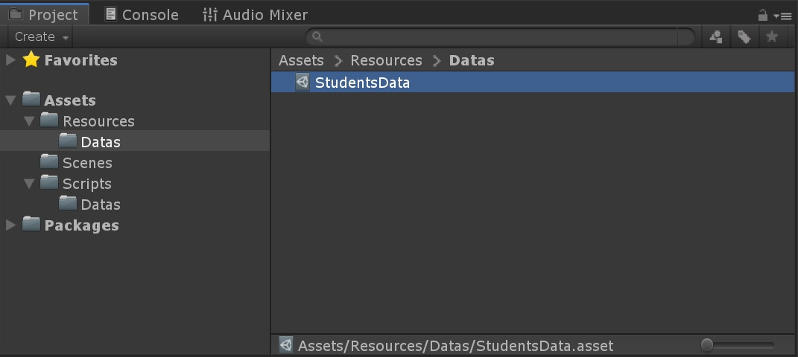
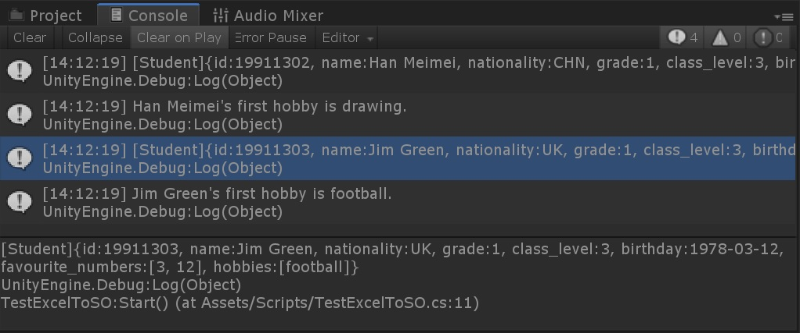

# Reading data in Unity which fulfilled in a new xlsx file

## We Assume You've Finished

1. Created or opened a Unity project
2. Finished in importing "Excel To ScriptableObject" into your project with no compiling error

## Guiding in Progress

1. Create a folder named "Excels" besides "Assets" folder in your Unity project. The name of the new folder could be any valid folder name you prefer. It is recommended to place the folder besides "Assets" folder, thus relative path could be used to locate your xlsx files.

2. Create a new xlsx file named "StudentsData.xlsx"

3. Rename the sheet with "Student" and fill the sheet with data in following image. Remember to "save" the file.

   **Note : ** An xlsx can contain more than one sheet. The sheet name "Student" means all items in this sheet will be Student type.

   

4. Back to Unity. Open "Excel to ScriptableObject" configuration window.

   

5. Modify global settings. In this guide, the 1st row in all sheets represents field name, and the 2nd represents data type. The 3rd row is used for comments, and data begins from the 4th row.

    

6. Add new excel configuration

   

7. Select "StudentsData.xlsx" that just saved.

   

8. Specify which folder the C# code and data asset will be saved in. And Set the namespace, can be empty, of the generated code.

   

   **Note :** In the image above, "Hide Asset Properties" is checked to make data in asset visible in Inspector window. The generated data assets will be saved in "Resources/Datas" folder, thus it's available to load the asset via "Resources.Load".

9. Click the button "Process Excel".

   After compiling the generated code, two files, "StudentsData.cs" and "StudentsData.asset", will be in your project.

   

   

   Content of "StudentsData.cs" :

   

   Content of "StudentsData.asset" in Inspector window :

   

10. Create a new C# code "TestExcelToSO.cs" for test.

    

11. Run the code above and check Console window for result.

    

