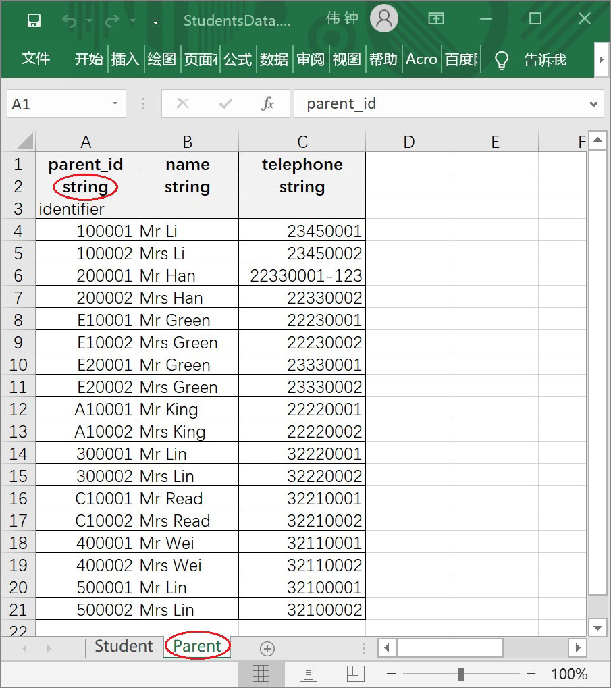
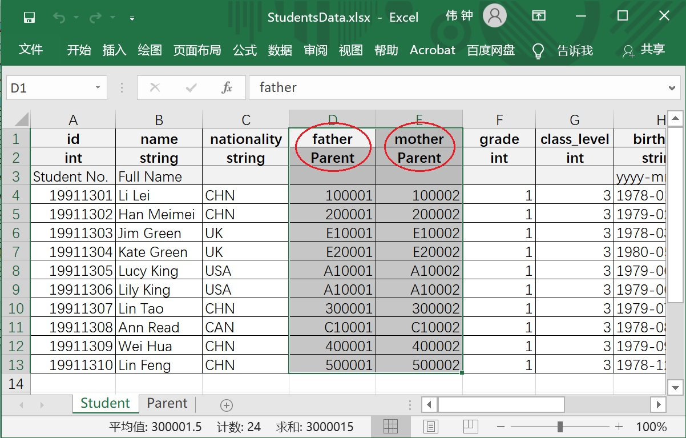
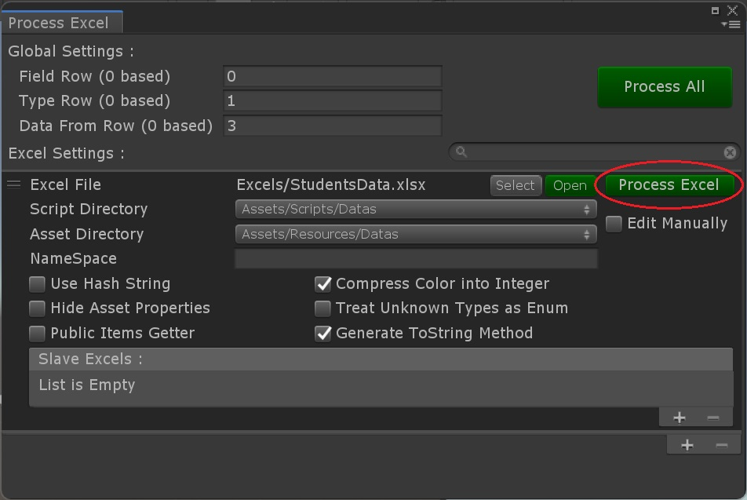
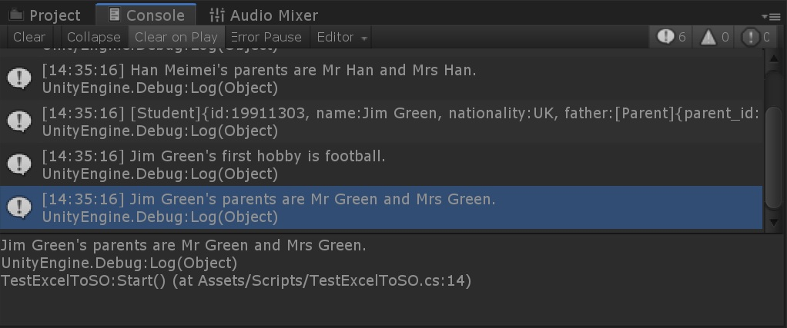
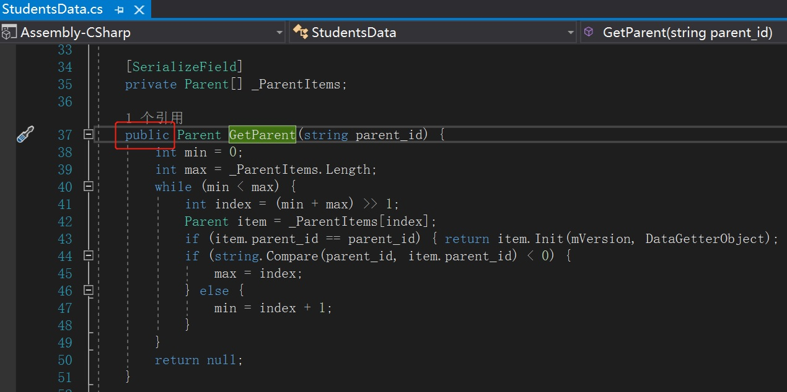
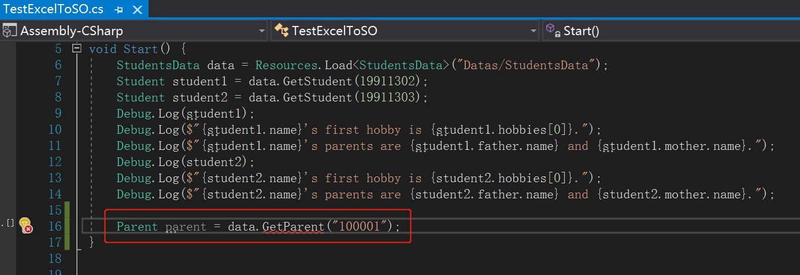

# 使用数据类型嵌套

## 准备工作

完成[从创建新xlsx文件到在运行时读取其定义的数据](./Guide1E1_CN.md)中的内容

## 操作流程

1. 在StudentsData.xlsx表格文件中新增一个Sheet，将其重命名为Parent并填充数据。
   
   

2. 在Student表中新增两列，名为father和mother，其类型均为Parent，并为其填充数据，此列内容应与Parent表中的parent_id对应。
   
   

3. 回到Unity中并重新运行“Process Excel”。
   
   

4. 修改测试代码。
   
   

5. 运行测试，并查看控制台输出。
   
   

6. 隐藏GetParent方法。
   
   当前情况下，StudentsData中GetParent方法为public方法。
   
   
   
   逻辑代码可以正常调用GetParent方法。
   
   
   
   回到StudentsData.xlsx中，将Parent表的名称改为“.Parent”，并回到Unity中重新运行“Process Excel”。
   
   
   
   此时出现了编译错误，GetParent方法无法调用。
   
   
   
   在解决完编译错误后**重新运行“Process Excel”**，以保证数据的正确。
