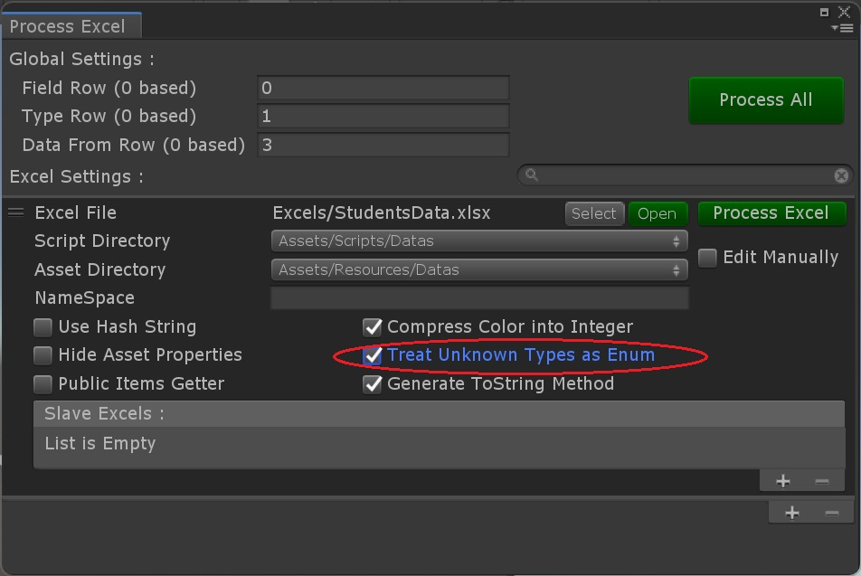
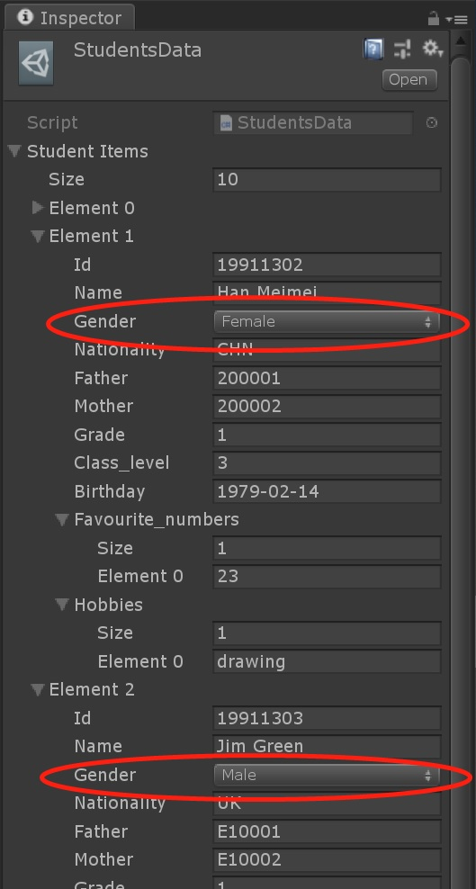
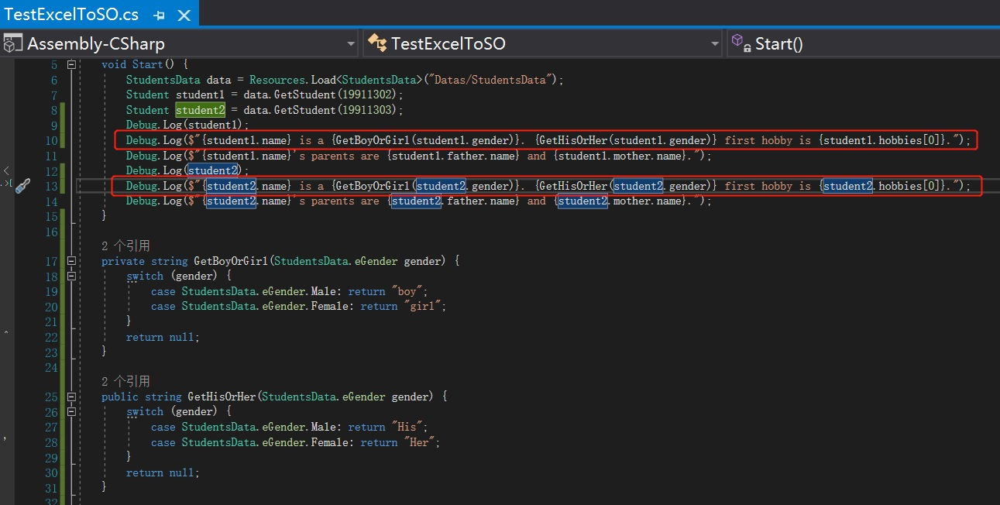
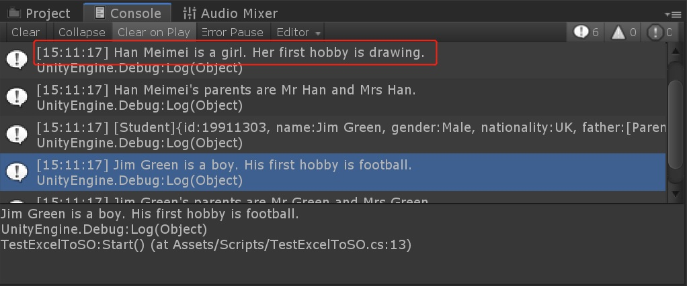
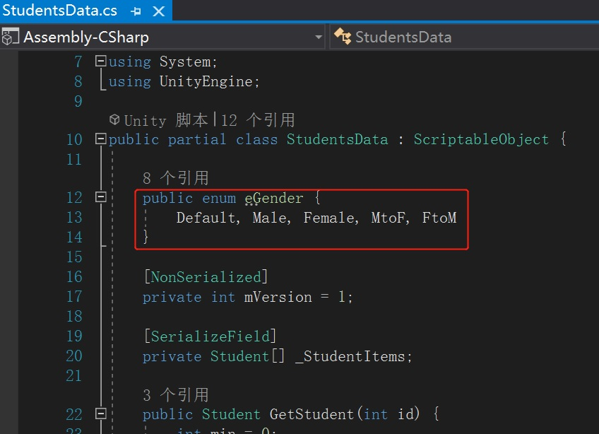

# Using Enum types

## We Assume You've Finished

Finished the guidance [Using nested types](./Guide1E2_EN.md)

## Guiding in Progress

1. Open "StudentsData.xlsx" and insert a new column named "gender" and typed eGender in "Student" sheet. and fill the genders, Male or Female, of all students in the sheet.

   

2. Go back to "Excel to ScriptableObject" configuration window in Unity, and check "Treat Unknown Types as Enum" for "StudentsData.xlsx" to make customized enum types supported.

   

3. Execute "Process Excel" to regenerate C# code and data asset.

   And the data asset in Inspector window :

   

4. Open "TestExcelToSO.cs" and add more info according gender to the printed contents.

   

5. Run the code and check Console window for result.

   

6. Predefine enum values to make sure the enum values will always be defined whether used or not.

   Insert some empty lines in "Student" sheet in "StudentsData.xlsx" and keep their first column empty. Fill the gender column with all available values with each value in a single row.

   

   If the content of first column of an data item is empty, the data item will be ignored.

   The enum values of an enum type will be the collection of all values that present in the enum type fields.
   
   After re-executing "Process Excel", the definition of "eGender" will be :
   
   

**Note :** "Default" will always be the first enum value of all customized enum type, and will always be the default value if enum value is not specified.