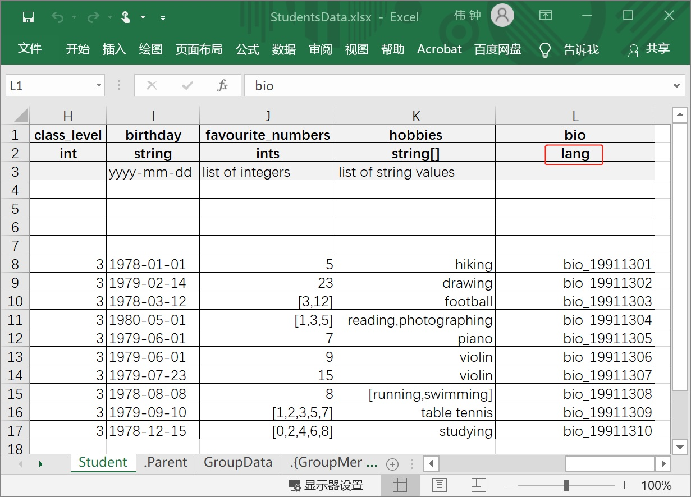
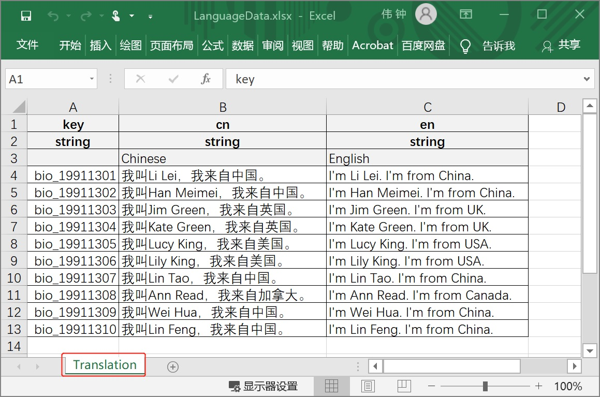
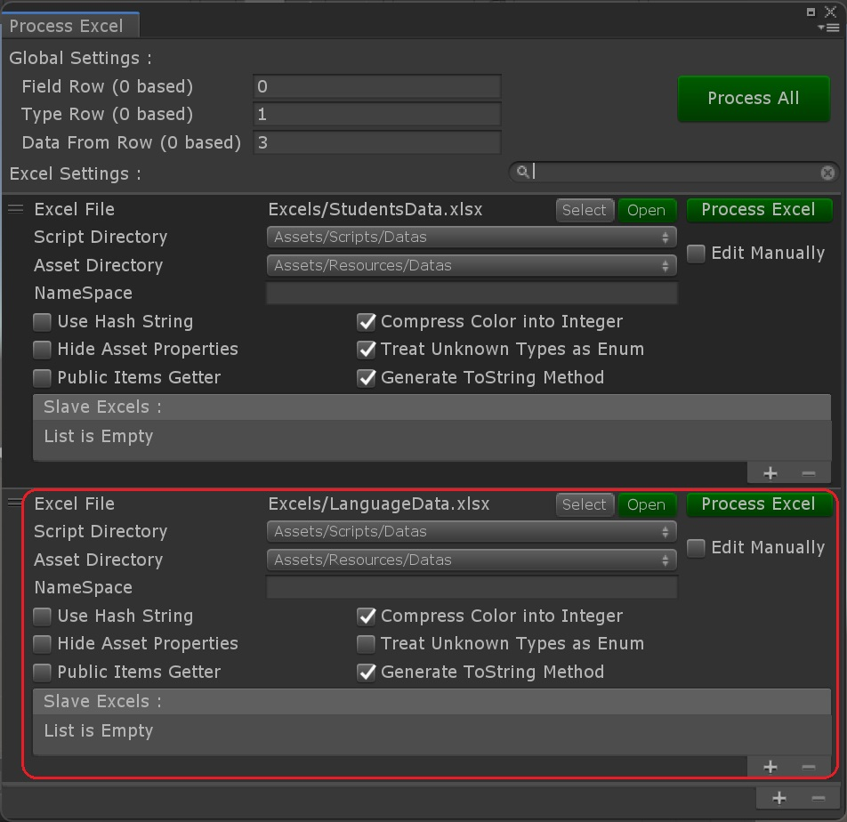
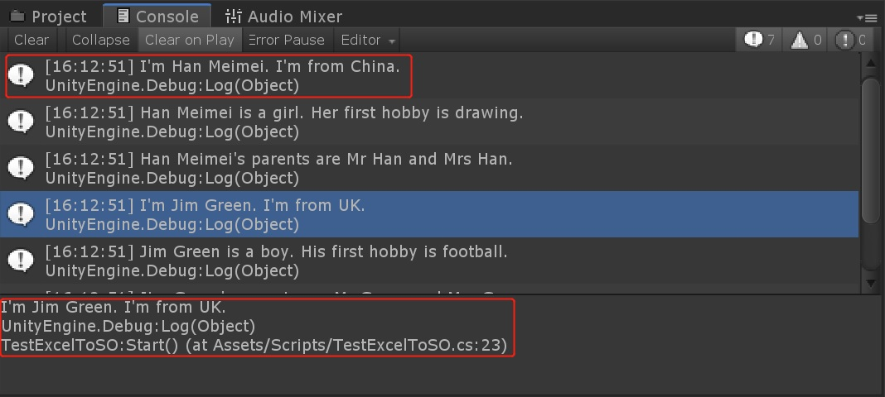

# 使用多语言特性

## 准备工作

完成[从创建新xlsx文件到在运行时读取其定义的数据](./Guide1E1_CN.md)或后续内容

## 需求说明

此示例中，我们将在学生的配置中增加一列自我介绍（bio），此列内容为多语言文本，使用多语言键对应多语言表中的多语言文本。

此外，在新建的多语言配置表中，将包含多语言键所对应的中文和英文内容。

## 操作流程

1. 在StudentsData.xlsx表格文件的Student表中新增一列，其字段名为bio，类型为lang，并为所有学生的bio填入多语言键。

   

2. 在StudentsData.xlsx的旁边创建一个新的表格文件，命名为LanguageData.xlsx，并将唯一的Sheet改名为Translation，根据上一步的需要填充内容。

   

3. 回到Unity中，在工具管理界面增加一新的Excel条目，选择LanguageData.xlsx，并配置好其代码、资源路径及其他规则。

   

4. 对两Excel分别执行“Process Excel”操作或执行“Process All”操作，并确保执行成功。

5. 编辑TestExcelToSO.cs文件，加载LanguageData并编写翻译方法。

   

6. 继续编辑TestExcelToSO.cs，为StudentsData的实例指定其翻译使用的方法，并打印测试用的学生的bio属性。

   

7. 回到Unity中，运行TestExcelToSO.cs中的代码，在Console中查看结果。

   

