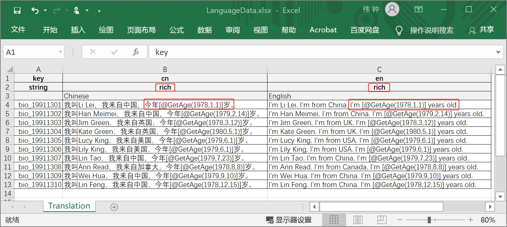
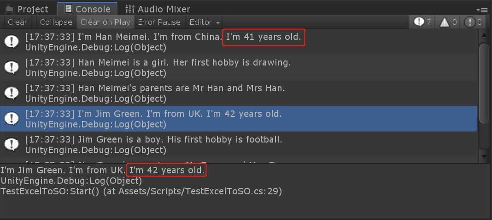

# 使用富文本特性

## 准备工作

完成[使用多语言特性](./Guide3E1_CN.md)中的内容

## 需求说明

在学生的自我介绍的内容中，我们将增加其年龄的描述。年龄根据数据条目初始化时的时间进行实时计算得到，定义计算年龄的方法为string GetAge(int year, int month, int date)。其参数表示生日的年月日，返回值为表示年龄数字内容的字符串。其生日将被配置在多语言文本中。

此示例中我们将用到另一个工具：StringEnricher，此工具为https://github.com/greatclock/reflection_tools.git的一部分，用于通过反射的方法调用字符串中的填充函数或变量以替换其内容，以达到动态逻辑内容填充的目的。

若跟随此引导流程进行操作，请自行导入StringEnricher工具。

## 操作流程

1. 在LanguageData.xlsx表格文件的Translation表中cn和en的类型从string改为rich，并在其内容中增加对GetAge的调用以获取年龄。
   
   

2. 回到Unity中重新对LanguageData运行“Process Excel”。

3. 编辑TestExcelToSO.cs文件，新增string GetAge(int year, int month, int date)方法。
   
   

4. 创建StringEnricher对象，并为将GetAge注册到该对象中作为内容填充方法。
   
   

5. 为LanguageData的实例指定Enrich方法，此方法内部调用StringEnricher的实例实现内容填充。
   
   

6. 回到Unity中，运行TestExcelToSO.cs中的代码，在Console中查看结果。
   
   